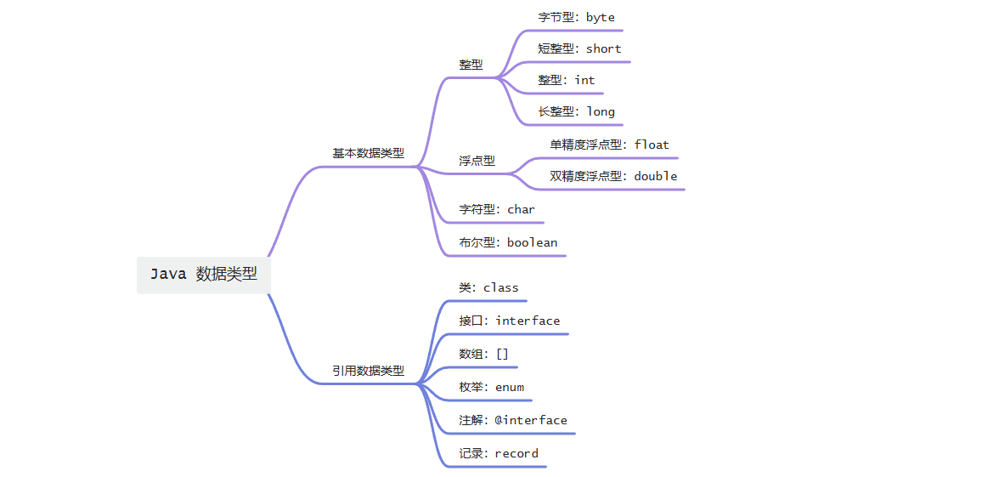
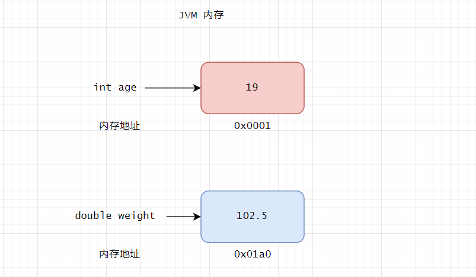

# 为什么需要变量

一花一世界，如果把一个程序看做一个世界或一个社会的话，那么变量就是程序世界的花花草草、万事万物。即，变量是程序中不可或缺的组成单位，最基本的存储单元。

# 初识变量

变量的概念：

* 内存中的一个存储区域，该区域的数据可以在同一个类型范围内不断变化
* 变量的构成包含三个要素：数据类型、变量名、存储的值
* Java 中变量声明的格式：数据类型 变量名 = 变量值

变量的作用：用于在内存中保存数据

使用变量需要注意：

* Java 中每个变量必须先声明，后使用。
* 使用变量名来访问这块区域的数据。
* 变量的作用域：其定义所在的一对 {} 内。
* 变量只有在其作用域内才有效。出了作用域，变量不可以再被调用。
* 同一个作用域内，不能定义重名的变量。

# Java 中变量的数据类型

Java 中的变量的数据类型分为两大类：

* 基本数据类型：包括整数类型、浮点数类型、字符类型、布尔类型
* 引用数据类型：包括数组、类、接口、枚举、注解、记录



# 变量的使用

## 步骤 1：变量的声明

格式：数据类型 变量名；

```java
// 例如：
// 存储一个整数类型的年龄
int age; 

// 存储一个小数类型的体重
double weight;

// 存储一个单字符类型的性别 
char gender;

// 存储一个布尔类型的婚姻状态
boolean marry;

// 存储一个字符串类型的姓名
String name;

// 声明多个同类型的变量
int a, b, c; // 表示 a，b，c 三个变量都是 int 类型
```

> 注意：变量的数据类型可以是基本数据类型，也可以是引用数据类型。

步骤 2：

给变量赋值，就是把“值”存到该变量代表的内存空间中。同时，给变量赋的值类型必须与变量声明的类型一致或兼容。

变量赋值的语法格式：变量名 = 值;

举例 1：可以使用合适类型的常量值给已经声明的变量赋值

```java
age = 18;
weight = 109;
gender = '女';
```

举例 2：可以使用其他变量或者表达式给变量赋值

```java
int m = 1;
int n = m;

int x = 1;
int y = 2;
int z = 2 * x + y;
```

举例 3：变量可以反复赋值

```java
// 先声明，后初始化
char gender;
gender = '女';

// 给变量重新赋值，修改 gender 变量的值
gender = '男';
// gender = 男
System.out.println("gender = " + gender);
```

举例 4：也可以将变量的声明和赋值一并执行

```java
boolean isBeauty = true;
String name = "迪丽热巴";
```

内存结构如图：

